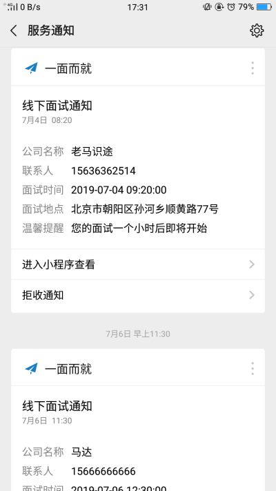

# [一面而就](https://github.com/hanzg1205/miniApp)

> 一面而就 是一款微信小程序。
> 一面而就 是基于 mpvue框架 + webpack + vueX + 原生api。

## 一面而就 Screenshots

|         首页         |        添加面试         |         选择地址         |         选择时间         |
| :------------------: | :-------------------: | :----------------------: | :----------------------: |
|  |  |  |  |

|         成功提示          |          面试状态           |            面试状态            |          面试详情           |
| :-------------------: | :-------------------------: | :----------------------------: | :-------------------------: |
|  |  |  |  |

|        面试详情        |          打卡           |        个人中心         |         消息提醒         |
| :------------------: | :-------------------------: | :---------------------: | :------------------: |
|  |  |  |  |

## 一面而就 Tips

> - 一面而就 正在更新维护状态。
> - 倘若您发现 Bug 或者有优化意见及其他宝贵意见，欢迎您提交 issue 或者联系我 qq = 152742986 、Email = 1527842986@qq.com

## 一面而就 本地部署

> 1. git clone https://github.com/hanzg1205/miniApp
> 2. 安装依赖 cnpm install
> 3. npm start
> 4. 在微信开发者工具中打开

## End

> - 喜欢 一面而就，帮忙点个 Star 吧!
> - 作者还会不断更新， 您的支持是作者不断更新的动力!
> - Thanks!

## About Me

> Name: hanzg1205
>
> QQ: 1527842986
>
> Email：1527842986@qq.com
